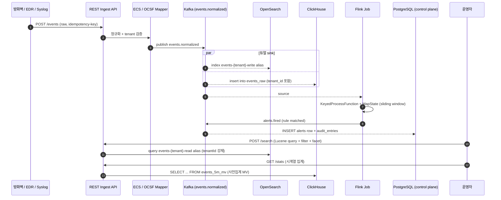
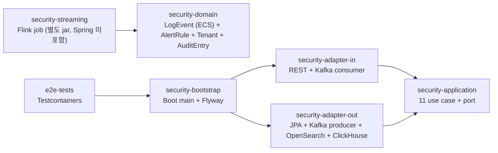
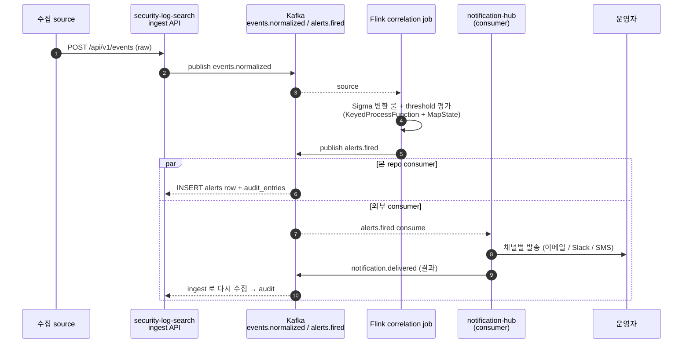

# Security Log Search

[](https://github.com/ssa1004/security-log-search/actions/workflows/ci.yml)
[](LICENSE)
[](https://openjdk.org/projects/jdk/21/)
[](https://spring.io/projects/spring-boot)
[](https://flink.apache.org/)
[](https://opensearch.org/)
[](https://clickhouse.com/)
[](.editorconfig)

대용량 보안 로그를 수집·정규화·검색·분석하는 SIEM 형태의 백엔드 플랫폼입니다.
다양한 source (방화벽 / EDR / 시스템 / 응용 로그) 의 raw event 를 ECS (Elastic Common Schema,
보안·관측 로그 표준) 또는 OCSF (Open Cybersecurity Schema Framework, 벤더 중립 보안 로그
표준) 로 정규화하고, Kafka 를 거쳐 OpenSearch (full-text 검색) + ClickHouse (대용량 집계) 로
듀얼 sink 합니다. Apache Flink 로 실시간 correlation rule (상관 규칙) 을 평가해서 알람을
발화합니다.

자세한 설계 의사결정은 [docs/adr/](docs/adr/) 의 ADR 15건을 참고하세요 — ECS / OCSF, ClickHouse +
OpenSearch 듀얼 sink, Kafka + Flink correlation, Multi-tenant 4-layer 격리, ISMS-P 통제 매핑,
Sigma 룰 import, CloudTrail / K8s audit 어댑터, 운영 dashboard 등.

## 처리 흐름



## 모듈 구조



| 모듈 | 책임 |
|---|---|
| `security-domain` | LogEvent (ECS), OCSF mapper, AlertRule, Tenant, AuditEntry, Severity 등 외부 의존성 0 도메인 모델 |
| `security-application` | 11개 use case + in / out port 정의 |
| `security-adapter-out` | JPA control plane (tenants / alert_rules / alerts / audit_entries), Kafka producer (events.normalized + alerts.fired), OpenSearch Java client, ClickHouse JDBC |
| `security-adapter-in` | REST API (ingest / search / stats / alert-rules / alerts / admin / audit / tenants), Kafka consumer (alerts.fired) |
| `security-streaming` | Apache Flink job — KeyedProcessFunction + MapState + broadcast state 로 룰 평가, Kafka source / sink |
| `security-bootstrap` | Spring Boot main, application.yml (profile dev / prod), Flyway 마이그레이션, OpenSearch / ClickHouse 초기 스키마 적용 |
| `e2e-tests` | Testcontainers (Postgres + Kafka + OpenSearch + ClickHouse) 기반 통합 시나리오 |

## 11개 use case

1. **`IngestLogEventUseCase`** — `POST /api/v1/events` — raw → ECS / OCSF 정규화 → Kafka publish.
   Idempotency-Key 헤더로 중복 방지 (Postgres `idempotency_keys` 테이블).
2. **`SearchLogEventsUseCase`** — `POST /api/v1/search` — OpenSearch query (Lucene query string +
   filter + facet) + cursor pagination. tenantId 자동 주입.
3. **`AggregateLogStatsUseCase`** — `GET /api/v1/stats` — ClickHouse query (5분 / 1시간 / 1일
   bucket, top-N, percentile p95 / p99).
4. **`DefineAlertRuleUseCase`** — `POST /api/v1/alert-rules` — 룰 CRUD, PostgreSQL 영속.
5. **`EvaluateAlertUseCase`** — Flink job 이 평가 후 Kafka `alerts.fired` 발행 + Spring 측
   consumer 가 INSERT.
6. **`ListAlertsUseCase`** — `GET /api/v1/alerts` — 타임라인 조회.
7. **`ManageOpenSearchIndexUseCase`** — admin endpoint — 인덱스 생성 / alias swap / ILM 정책 /
   rollover trigger.
8. **`QueryAuditLogUseCase`** — `GET /api/v1/audit` — ISMS-P 요구. 누가 언제 어떤 검색 / 룰
   변경 / 알람 처리 했는지 audit.
9. **`OnboardTenantUseCase`** — `POST /api/v1/tenants` — 신규 tenant 등록 시 OpenSearch alias
   자동 생성 + ClickHouse Row Policy 자동 wiring.
10. **`ImportSigmaRuleUseCase`** — `POST /api/v1/sigma-rules` — SigmaHQ YAML (단일 / multi-document) →
    `AlertRule` 변환 + 미지원 변환 한계 (`mappingNotes`) 반환 (ADR-0013).
11. **`ListImportedSigmaRulesUseCase`** — `GET /api/v1/sigma-rules` — import 한 Sigma 원본 / 변환 결과
    조회. import 한 룰의 stale 검토용.

## 멀티테넌트 격리 — 4 layer

1. **OpenSearch index naming**: `events-{tenant}-{yyyy.MM.dd}-{seq}`. read alias
   (`events-{tenant}-read`) 가 그 tenant 인덱스만 가리킴.
2. **ClickHouse Row Policy**: `WHERE tenant_id = currentSetting('tenant_id')` 강제.
3. **JWT claim**: 모든 요청은 `tenant_id` claim 을 가져야 하고, application layer 가 query
   에 자동 주입.
4. **Query rewrite**: SearchService 내부에서 사용자가 보낸 query 에 tenant filter 를 강제로
   AND 결합 — 사용자가 우회 불가.

```mermaid
sequenceDiagram
    autonumber
    participant U as 운영자 (acme)
    participant API as REST API
    participant Sec as SecurityFilterChain
    participant Svc as SearchService
    participant OS as OpenSearch
    participant CH as ClickHouse

    U->>API: POST /search { q: "*" } + JWT
    API->>Sec: JWT 검증 + tenant claim 추출
    Note over Sec: claim.tenant_id = "acme"
    Sec->>Svc: OperatorContext(tenant=acme) 주입
    Svc->>Svc: query rewrite — q AND tenantId:acme
    par OpenSearch 경로
        Svc->>OS: GET events-acme-read/_search
        Note over OS: alias 가 acme 인덱스만 가리킴 (1)
    and ClickHouse 경로
        Svc->>CH: SET tenant_id='acme'; SELECT ...
        Note over CH: Row Policy 가 tenant_id 일치 행만 (2)
    end
    Note over U,CH: 다른 tenant (globex) 인덱스 / 행은<br/>4 layer 모두에서 차단됨
```

자세한 내용은 [ADR-0007](docs/adr/0007-multi-tenant-isolation.md).

## 기술 스택

- **Language**: Java 21 (virtual threads on)
- **Framework**: Spring Boot 3.4
- **Storage**:
  - PostgreSQL 16 (control plane: tenants / alert_rules / alerts / audit_entries / idempotency)
  - OpenSearch 2.x (full-text 검색, 운영자 ad-hoc query)
  - ClickHouse 24.x (대용량 aggregate / 시계열)
- **Messaging**: Apache Kafka (idempotent producer + Spring Kafka consumer)
- **Streaming**: Apache Flink 1.18 (KeyedProcessFunction + MapState + Broadcast State)
- **Resilience**: Resilience4j (Bulkhead + CB + Retry for OpenSearch / ClickHouse)
- **Observability**: Micrometer + Prometheus
- **API doc**: springdoc-openapi (Swagger UI)
- **Build / CI**: Gradle 8, GitHub Actions, Docker multi-stage, Helm + ArgoCD
- **Test**: JUnit 5 + Mockito + Testcontainers, Flink correlation 은 ProcessFunction 직접 호출
  (1.18 + Java 17+ record 직렬화 이슈로 LocalExecutionEnvironment 통합 테스트는 1.19 업그레이드 후 복귀 예정)

## 빠른 실행

### 단위 테스트만

```bash
./gradlew test
```

### Testcontainers 통합 테스트 (Docker 필요)

```bash
./gradlew :e2e-tests:integrationTest
```

### Docker compose 로 의존성 + 앱 한번에

```bash
cd infrastructure/docker
docker compose up -d            # postgres + kafka + opensearch + clickhouse + flink
docker compose --profile app up # 위 + 앱 컨테이너
```

기본 endpoint:

- 앱: <http://localhost:8080>
- Swagger UI: <http://localhost:8080/swagger>
- Actuator: <http://localhost:8080/actuator>
- OpenSearch Dashboards: <http://localhost:5601>
- Flink Web UI: <http://localhost:8081>

### Flink job 단독 실행 (운영 시뮬레이션)

```bash
./gradlew :security-streaming:jar
# 빌드된 jar 를 Flink 클러스터에 submit
flink run -c com.example.security.streaming.AlertCorrelationJob \
  security-streaming/build/libs/security-streaming-0.1.0.jar
```

### Sigma 룰 import → AlertRule → Flink → Alert 데모

`scripts/sample-sigma-rules/` 의 4 개 SigmaHQ 포맷 룰 (brute-force, port scan, suspicious
PowerShell, off-hours admin logon) 을 한 번에 import 하고, brute-force 트리거 이벤트를
발사해 알람까지 도달하는 흐름을 보여줍니다.

```bash
./scripts/seed_demo_data.sh                  # 1) tenant 'globex' 추가 + 기본 룰 1건
./scripts/import_sigma_demo.sh               # 2) Sigma 4개 import + 트리거 이벤트
curl -s 'http://localhost:8080/api/v1/alerts?tenantId=acme' | jq    # 3) 알람 확인
```

`scripts/sample-sigma-rules/` 의 YAML 은 [SampleSigmaRulesIntegrationTest](security-application/src/test/java/com/example/security/application/sigma/SampleSigmaRulesIntegrationTest.java)
가 매번 parse + 변환을 검증하므로 mapper 가 변경되면 데모도 같이 깨져 stale 안 됨.

## ISMS-P 통제 매핑

ISMS-P 인증 요구를 본 시스템 안에서 어떻게 구현했는지의 매핑은 [ADR-0010](docs/adr/0010-isms-p-control-mapping.md)
를 참고하세요. 핵심:

- 2.5 (사용자 식별 / 인증) → JWT Resource Server + tenant claim
- 2.7 (암호화) → at-rest (PostgreSQL TDE / ClickHouse / OpenSearch encryption-at-rest)
  + in-transit (TLS 1.3 + Kafka mTLS)
- 2.9 (감사) → `audit_entries` append-only + Kafka SIEM sink + 5년 보존
- 2.10 (사고 대응) → Flink correlation rule + alert workflow

## ADR 인덱스

| ADR | 제목 |
|---|---|
| [0001](docs/adr/0001-hexagonal-architecture.md) | Hexagonal architecture + 모듈 분리 (security-streaming 별도 jar) |
| [0002](docs/adr/0002-ecs-vs-ocsf.md) | ECS vs OCSF — 둘 다 매핑하는 이유 |
| [0003](docs/adr/0003-dual-sink-opensearch-clickhouse.md) | OpenSearch + ClickHouse 듀얼 sink |
| [0004](docs/adr/0004-flink-vs-kafka-streams.md) | Kafka 수집 + Flink 스트리밍 (vs Kafka Streams) |
| [0005](docs/adr/0005-clickhouse-schema.md) | ClickHouse 스키마 — MergeTree + 월별 partition + materialized view |
| [0006](docs/adr/0006-opensearch-ilm-alias.md) | OpenSearch ILM + alias swap + hot/warm/cold tier |
| [0007](docs/adr/0007-multi-tenant-isolation.md) | Multi-tenant 격리 — 4 layer |
| [0008](docs/adr/0008-alert-rule-engine.md) | Alert rule engine — Flink CEP + broadcast state hot reload |
| [0009](docs/adr/0009-backpressure.md) | Backpressure — Kafka consumer poll + Flink 자체 |
| [0010](docs/adr/0010-isms-p-control-mapping.md) | ISMS-P 통제 매핑 |
| [0011](docs/adr/0011-audit-log-append-only.md) | Audit log — append-only PostgreSQL + 보존 5년 |
| [0012](docs/adr/0012-pii-masking-retention.md) | PII 마스킹 + 보존 정책 |
| [0013](docs/adr/0013-sigma-rule-import.md) | Sigma 룰 import → AlertRule 변환 |
| [0014](docs/adr/0014-source-adapter-cloudtrail-k8s.md) | source 매퍼 분리 — CloudTrail / K8s audit → ECS |
| [0015](docs/adr/0015-observability-dashboards.md) | 운영 대시보드 — RED + USE 모델 기반 |

## 운영 가이드 (간단)

- **OpenSearch ILM**: `events-*-write` alias 가 size 50GB or age 30d 도달 시 자동 rollover.
  hot (7일) → warm (30일) → cold (90일) → delete (1년).
- **ClickHouse 보존**: `events_raw` PARTITION BY toYYYYMM(timestamp). 13개월 이상 된 partition
  은 매월 1일 새벽 DROP.
- **Audit 보존**: `audit_entries` 5년 (ISMS-P 권고). 별도 archive cold storage 로 이관.
- **알람 처리**: `POST /api/v1/alerts/{id}/ack` 로 운영자 확인 처리 → audit_entries 자동 기록.

### Runbook

장애 / 이상 상황별 대응 절차는 `docs/runbook/` 에 시나리오 단위로 정리:

- [`ingest-throughput-drop.md`](docs/runbook/ingest-throughput-drop.md) — ingest rate 가 평소 대비 50% 이하로 하락
- [`flink-job-not-progressing.md`](docs/runbook/flink-job-not-progressing.md) — Flink correlation job lag 누적 / checkpoint 실패
- [`alert-storm.md`](docs/runbook/alert-storm.md) — 알람 발화 폭주 (실제 사고 vs false positive 판정 / 룰 mute 절차)

## Deployment

### Helm chart

운영 / 스테이징 배포는 `infrastructure/helm/security-log-search/` 의 Helm chart 로 합니다
(Helm 3.x). env 별 override 는 `values-dev.yaml` / `values-staging.yaml` / `values-prod.yaml`.

```bash
cd infrastructure/helm/security-log-search

# dev — replica 1, NetworkPolicy / HPA / Ingress 비활성
helm install slq . --namespace security-log-search --create-namespace \
  --values values-dev.yaml

# prod — replica 3, HPA (cpu 70%, min 2 max 10), Ingress TLS, NetworkPolicy 활성
helm install slq . --namespace security-log-search --create-namespace \
  --values values-prod.yaml
```

chart 가 만드는 리소스:

- Deployment (graceful shutdown — preStop sleep + Spring `server.shutdown=graceful`)
- Service (ClusterIP)
- ConfigMap (non-secret env) + Secret (placeholder, 운영은 SealedSecret / ExternalSecret 권장)
- ServiceAccount + Role + RoleBinding (configmap / secret read 만 — ISMS-P 최소 권한)
- HPA (prod) / PodDisruptionBudget
- Ingress 사용자용 (`/api/v1/{events,search,alerts,sigma-rules,audit,stats}`) +
  admin 별도 host (`/api/v1/admin`, IP allowlist)
- NetworkPolicy (postgres / kafka / opensearch / clickhouse / redis egress 만 허용)
- ServiceMonitor (Prometheus Operator)

자세한 키 / env 별 차이 / SIEM 특성 (멀티테넌트 / admin 분리 / 외부 cluster 가정) 은
[infrastructure/helm/security-log-search/README.md](infrastructure/helm/security-log-search/README.md)
참고.

> OpenSearch / ClickHouse / PostgreSQL / Kafka / Redis 는 외부 cluster 를 가정합니다.
> chart 는 endpoint 만 주입하고 의존을 운영하지 않습니다.

> Flink correlation job 은 본 chart 에 포함되지 않습니다. 운영은
> [Flink Kubernetes Operator](https://github.com/apache/flink-kubernetes-operator)
> 의 `FlinkDeployment` / `FlinkSessionJob` CR 로 별도 관리.

### GitOps (ArgoCD)

- `infrastructure/argocd/applicationset.yaml` — dev / staging / prod 3개 Application 자동 생성
- 자세한 사용법은 [infrastructure/argocd/README.md](infrastructure/argocd/README.md)

## 향후 개선

- ML 기반 anomaly detection (현재는 룰 기반만, 추후 unsupervised baseline)
- Sigma 룰 source 자동 sync (현재는 수동 import — SigmaHQ 공식 repo 의 정기 pull / 검증 파이프라인)
- 추가 source 어댑터: Microsoft Graph Security, Okta system log, Crowdstrike Falcon stream
  (현재는 syslog / firewall / EDR / CloudTrail / K8s audit 까지 — ADR-0014)
- ClickHouse projection / aggregating MergeTree 추가 검토
- Flink Kubernetes Operator (apache/flink-kubernetes-operator) 로 streaming job 관리
- Flink 1.19+ 업그레이드 — `LocalExecutionEnvironment` 통합 테스트 복귀 (record 직렬화 이슈 해결됨)

## Portfolio Set 통합

본 repo 는 단독으로도 동작하지만, 다음 8개 repo 가 한 시스템처럼 맞물리는 portfolio set 의
한 축입니다. 프로필 README — <https://github.com/ssa1004/ssa1004> — 에 전체 그림이 있습니다.

| repo | 역할 | 본 repo 와의 관계 |
|---|---|---|
| [auth-service](https://github.com/ssa1004/auth-service) | OIDC / JWT 발급, JWK Set 노출 | 들어오는 요청의 JWT 를 본 repo 가 검증 (issuer-uri / JWK Set) |
| [notification-hub](https://github.com/ssa1004/notification-hub) | 멀티채널 알림 (이메일 / SMS / push / Slack) | 본 repo 의 `alerts.fired` Kafka topic 을 consume → 운영자에게 fan-out. 반대로 hub 의 발송 결과 (`notification.delivered`) 는 본 repo 가 audit 용으로 수집 |
| [search-service](https://github.com/ssa1004/search-service) | 일반 도메인 검색 (상품 / 문서) | 본 repo 와 별도 — search-service 의 audit log 는 본 repo 가 수집 |
| [billing-platform](https://github.com/ssa1004/billing-platform) | 결제 / 정산 도메인 | billing 의 application audit log 를 본 repo 가 수집 |
| [resell-orderbook](https://github.com/ssa1004/resell-orderbook) | 리셀 주문장 | 매칭 엔진의 app log 를 본 repo 가 수집 |
| [gpu-job-orchestrator](https://github.com/ssa1004/gpu-job-orchestrator) | GPU 학습 job 스케줄링 | K8s audit log 를 본 repo 가 ECS 매핑 후 수집 (ADR-0014) |
| [mini-shop-observability](https://github.com/ssa1004/mini-shop-observability) | OTel / Prometheus / Loki 플레이그라운드 | observability stack 공통 — 본 repo 의 Grafana dashboard 가 같은 패턴 |
| **security-log-search** | 본 repo — SIEM 수집 / 검색 / 알람 | — |

본 repo 의 통합점은 세 방향:

1. **들어오는 인증** — auth-service 의 JWK Set 으로 JWT 검증. claim 의 `tenant_id` 가
   query rewrite 의 1차 격리 keying 이 됨.
2. **나가는 alert** — Sigma rule 매칭 또는 threshold rule 평가가 성공하면 Flink job 이
   `alerts.fired` Kafka topic 에 publish. notification-hub 가 consume 해서 운영자에게
   채널별 발송.
3. **들어오는 audit** — 다른 portfolio service 의 application log / K8s audit / CloudTrail
   raw event 를 ingest API 로 받음. notification-hub 의 발송 결과도 보안 이벤트로 수집해서
   알림 누락 / 실패 추세를 운영자가 검색 가능.

### Cross-repo sequence — JWT 검증 + 검색

```mermaid
sequenceDiagram
    autonumber
    participant Caller as 다른 service<br/>(billing / search / ...)
    participant Auth as auth-service
    participant API as security-log-search<br/>(REST API)
    participant Sec as SecurityFilterChain
    participant Svc as SearchService
    participant OS as OpenSearch
    participant CH as ClickHouse

    Caller->>Auth: POST /oauth2/token (client_credentials)
    Auth-->>Caller: access_token (tenant_id claim 포함)
    Caller->>API: POST /api/v1/search + Bearer JWT
    API->>Sec: JWT 검증 (auth-service JWK Set)
    Sec->>Sec: claim.tenant_id 추출
    Sec->>Svc: OperatorContext(tenant=acme) 주입
    Svc->>Svc: query rewrite — q AND tenantId:acme
    par OpenSearch
        Svc->>OS: GET events-acme-read/_search
    and ClickHouse
        Svc->>CH: SET tenant_id='acme'; SELECT ...
    end
    Svc-->>API: hits + facets
    API-->>Caller: 200 OK (다른 tenant 데이터 0건 보장)
```

### Cross-repo sequence — Sigma 매칭 → alert → notification-hub



### 통합 시연 (mock)

전체 portfolio 를 다 띄울 필요 없이, **mock auth-service + mock notification-hub** 로
본 repo 의 통합점을 한 호스트에서 검증:

```bash
docker compose -f infrastructure/docker/docker-compose.integration.yml up -d
./scripts/integration-demo.sh
```

자세한 절차와 검증 포인트는 [scripts/integration-demo.sh](scripts/integration-demo.sh) 의 헤더 주석.

## 수동 GitHub push

`gh` CLI 가 없는 환경이면 다음으로 push.

```bash
git remote add origin https://github.com/ssa1004/security-log-search.git
git branch -M main
git push -u origin main
```
